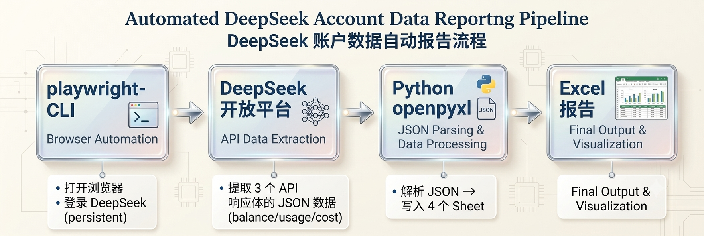

# DeepSeek API Usage Checker

[](LICENSE)

自动化提取 DeepSeek 开放平台用量信息 — 账户余额、各模型 Token 消耗（含缓存命中/未命中拆分）、消费金额、按日分布，一键生成结构化 Excel 报告。



## 功能

- ✅ 自动打开浏览器并捕获 DeepSeek 平台 API 响应
- ✅ 提取账户总览：充值余额、赠送余额、月消费、Token 估值
- ✅ 各模型 Token 明细：请求数、缓存命中/未命中、输出 Tokens、缓存命中率
- ✅ 各模型消费明细：按缓存命中/未命中/输出拆分费用
- ✅ 按日分布：当月逐日各模型用量明细
- ✅ 输出为 `.xlsx` 文件（4 个工作表），带格式化样式
- ✅ 支持有头/无头两种模式

## 环境要求

| 依赖 | 版本要求 | 安装 |
|------|----------|------|
| [playwright-cli](https://github.com/anthropics/claude-code/tree/main/.claude/skills/playwright-cli) | 最新 | Claude Code 内置 / `npm install -g playwright-cli` |
| Python | ≥ 3.8 | [python.org](https://www.python.org/) |
| openpyxl | ≥ 3.0 | `pip install openpyxl` |
| Git Bash | （Windows 需要） | [git-scm.com](https://git-scm.com/) |

## 使用说明

### Windows

双击 `check_ds.cmd`，或从命令行运行：

```cmd
check_ds.cmd
```

支持 `--headless` 参数（需已登录过）：

```cmd
check_ds.cmd --headless
```

### macOS / Linux

```bash
bash check_ds.sh            # 交互模式（显示浏览器）
bash check_ds.sh --headless # 无头模式
```

### 首次使用

首次运行需要手动登录 DeepSeek 开放平台：

1. 运行脚本（**不要加** `--headless`）
2. 浏览器自动打开 [platform.deepseek.com/usage](https://platform.deepseek.com/usage)
3. 在浏览器中手动登录（手机号/密码）
4. 切换回终端，按 Enter 继续
5. 脚本自动提取数据并生成 Excel

后续运行使用 `--headless` 模式即可自动复用登录状态。

## 输出说明

输出文件位于 `reports/ds-<日期时间戳>.xlsx`，包含 4 个工作表：

| Sheet | 内容 |
|-------|------|
| **账户总览** | 充值余额、赠送余额、月消费、当月 Token 总量、可用 Token 估值 |
| **模型用量** | 各模型请求数、缓存命中/未命中/输出 Tokens、缓存命中率 |
| **消费明细** | 按模型拆分缓存命中/未命中/输出费用（CNY），含总计行 |
| **按日分布** | 当月逐日各模型用量明细（Token + 金额） |

### 数据字段

| 字段 | 来源 | 含义 |
|------|------|------|
| `normal_wallets[].balance` | API #11 | 充值余额 (CNY) |
| `bonus_wallets[].balance` | API #11 | 赠送余额 (CNY) |
| `monthly_costs[].amount` | API #11 | 当月总消费 (CNY) |
| `PROMPT_CACHE_HIT_TOKEN` | API #12 | 输入缓存命中 Token 数 |
| `PROMPT_CACHE_MISS_TOKEN` | API #12 | 输入缓存未命中 Token 数 |
| `RESPONSE_TOKEN` | API #12 | 输出 Token 数 |
| `REQUEST` | API #12 | API 请求次数 |

### 数据关系

```
总输入 Tokens = CACHE_HIT + CACHE_MISS
缓存命中率   = CACHE_HIT / (CACHE_HIT + CACHE_MISS) × 100%
模型总 Tokens = CACHE_HIT + CACHE_MISS + RESPONSE
```

## 工作原理

```
┌──────────────┐    ┌──────────────────┐    ┌──────────────────┐
│ 打开浏览器    │───▶│ 捕获 API 请求     │───▶│ 提取响应体 JSON   │
│ (Playwright)  │    │ (requests 列表)    │    │ (response-body)   │
└──────────────┘    └──────────────────┘    └────────┬─────────┘
                                                     ▼
┌──────────────┐    ┌──────────────────┐    ┌──────────────────┐
│ Excel 报告    │◀───│ Python openpyxl   │◀───│ 3 个 JSON 文件   │
│ (4 个 Sheet)  │    │ 生成格式化表格     │    │ (临时目录)        │
└──────────────┘    └──────────────────┘    └──────────────────┘
```

为什么不通过 `page.evaluate(fetch())` 获取数据？——DeepSeek 平台的 API 请求携带了 HttpOnly Cookie 和 `authorization` header，这些在 `fetch()` 中不可用。脚本通过 Playwright 的请求拦截机制直接读取浏览器已发出的 XHR 响应，无需处理认证。

## 项目结构

```
deepseek-api-usage-checker/
├── check_ds.sh              # 主脚本（Bash + 内嵌 Python）
├── check_ds.cmd             # Windows 启动器
├── references/
│   └── gen_report.py        # Python 报告生成器（独立版本）
├── reports/                 # Excel 输出目录（自动创建）
├── ds.png                   # 示例截图
├── .gitattributes
├── LICENSE
└── README.md
```

## 注意事项

1. **数据延迟**：DeepSeek 平台数据约有 5 分钟延迟
2. **请求 ID 不固定**：每次 session 的请求 ID 可能变化，脚本会自动检测
3. **Authorization Token 时效**：Token 有有效期，过期后需重新登录
4. **时区**：所有日期按 UTC+0 显示
5. **Python 版本**：Windows 上使用 `python` 而非 `python3`（Windows Store `python3` 有沙箱限制）
6. **UI 不完整**：页面 Snapshot 不显示缓存命中/未命中拆分，必须通过 API 响应获取

## 已知坑

- **不要**用 `page.evaluate(fetch())` 替代 `response-body` — `fetch()` 不携带认证 Cookie
- 请求号 11/12/13 每次 session 可能不同，脚本通过 URL 模式匹配自动发现
- 月份选择器包含未来日期，无数据的天填充为零

## License

[MIT](LICENSE)
